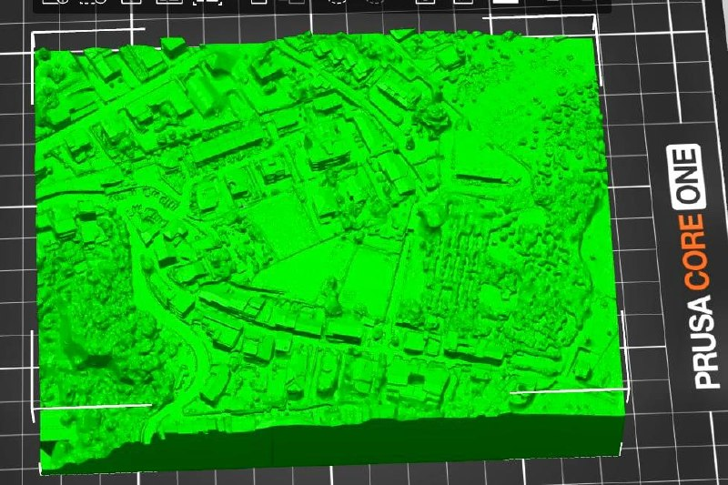
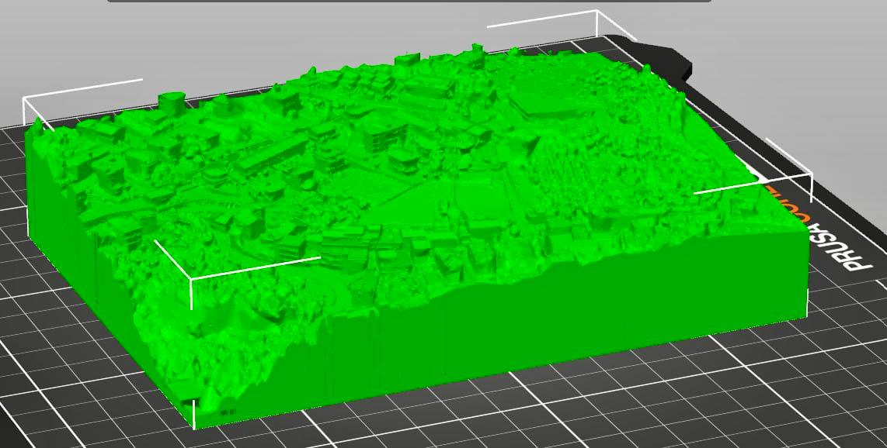

# Snapsolid

**Photogrammetry to 3D-printable STL pipeline.**

<p align="center">
  
  
</p>
<p align="center"><em>330 drone photos → printable STL, ready for slicing</em></p>

Snapsolid bridges the gap between drone photogrammetry and 3D printing. It takes a folder of photos and produces a watertight, print-ready STL file — handling photo quality filtering, 3D reconstruction, mesh cleaning and topological repair, and export in a single automated pipeline.

### Why Snapsolid?

3D reconstruction from photos typically produces meshes that are far from printable: open surfaces, non-manifold edges, floating fragments, and no flat base. Fixing these manually in MeshLab or Blender is tedious and error-prone.

Snapsolid was designed to be operated by an AI coding agent (like Claude Code): point it at a folder of photos, and it handles everything autonomously — quality filtering, reconstruction, repair, validation, and export — with built-in checks at every step. No manual intervention, no mesh editing, no GUI. It removes human effort from the equation entirely.

It's also fully modular: each pipeline step (quality gate, reconstruction, cleaning, base, export) is an independent module. Swapping Apple Object Capture for COLMAP, or pymeshlab for another repair library, requires changing a single file without touching the rest of the pipeline.

### Key features

- **Quality gate** — automatically filters blurry, overexposed, or low-feature photos before reconstruction
- **Apple Object Capture** — leverages Apple Silicon's hardware-accelerated photogrammetry for high-quality meshes
- **10-step topological repair** — fixes non-manifold edges, degenerate faces, holes, inconsistent normals, and STL float32 artifacts
- **Print-ready base** — adds a watertight rectangular base with smooth walls, in wrap (external) or crop (trim to rectangle) mode
- **Planar flattening** — optional region-based projection that makes building roofs and walls more rectangular
- **Scale to mm** — ensures the STL has correct dimensions for your slicer
- **Full traceability** — every run saves a JSON report with source photos path, parameters used, and equivalent CLI command

One command in, printable STL out.

## Requirements

- **macOS 13+** with **Apple Silicon** (M1/M2/M3/M4)
- **Xcode Command Line Tools** (`xcode-select --install`)
- Python 3.10+
- The `photogrammetry-cli` Swift binary (see [Building the CLI](#building-the-cli))

## Installation

```bash
pip install .
```

Or for development:

```bash
pip install -e ".[dev]"
```

## Quick Start

```bash
# Basic usage — photos in, STL out
snapsolid /path/to/photos -o /path/to/output

# Drone photogrammetry with full detail
snapsolid drone_photos/ -o output/ --detail full

# Smaller object, aggressive cleaning
snapsolid object_photos/ -o output/ --cleaning-preset aggressive

# Skip quality gate (pre-filtered photos)
snapsolid photos/ -o output/ --skip-quality-gate
```

## Pipeline Steps

1. **Quality Gate** — Filters photos by blur, exposure, and feature overlap (OpenCV)
2. **Reconstruction** — Apple Object Capture (RealityKit) produces a USDZ mesh
3. **USDZ → OBJ** — Extracts and converts the binary USD to OBJ via `usdcat`
4. **Mesh Cleaning** — 9-step topological repair (non-manifold, holes, normals)
5. **Fragment Removal** — Keeps only the largest connected component
6. **Planar Flattening** *(optional)* — Region growing + projection for buildings
7. **Decimation** *(optional)* — Quadric edge collapse to reduce face count
8. **Rectangular Base** — Adds a watertight base with smooth walls for printing
9. **Post-export integrity check** — Detects and fixes non-manifold edges introduced by STL float32 truncation
10. **Export** — Binary STL + JSON metadata report

## CLI Options

| Option | Default | Description |
|--------|---------|-------------|
| `--detail` | `full` | Reconstruction detail: `reduced`, `medium`, `full`, `raw` |
| `--ordering` | auto | Photo ordering: `sequential` (drone), `unordered` (handheld) |
| `--sensitivity` | `high` | Object Capture sensitivity |
| `--max-photos` | `0` | Limit photos for quality gate (0 = all) |
| `--cleaning-preset` | `standard` | `gentle`, `standard`, or `aggressive` |
| `--planar-flatten` | off | Flatten planar regions (buildings) |
| `--planar-angle-threshold` | `15.0` | Angle threshold for region growing (degrees) |
| `--planar-min-region` | `50` | Minimum faces for a planar region |
| `--planar-strength` | `0.7` | Projection strength (0-1, 1.0 = fully flat) |
| `--decimate` | off | Enable mesh decimation |
| `--decimate-target` | `1000000` | Target face count |
| `--base-mode` | `wrap` | Base mode: `wrap` (external) or `crop` (trim to rectangle) |
| `--base-margin` | `2.0` | Base margin around mesh (mesh units) |
| `--base-height` | `5.0` | Base wall height (mesh units) |
| `--scale-to-mm` | `0` | Scale model so longest side = N mm (0 = no scaling) |
| `--skip-quality-gate` | off | Skip photo filtering |
| `--skip-cleaning` | off | Skip mesh repair |
| `--skip-base` | off | Skip rectangular base |
| `-v` | off | Verbose logging |

## Python API

```python
from snapsolid.pipeline import Pipeline
from snapsolid.config import PipelineConfig

pipeline = Pipeline(PipelineConfig())
result = pipeline.run(
    input_path="photos/",
    output_dir="output/",
    detail="full",
    cleaning_preset="standard",
)
print(result.summary())
```

## Claude Code Integration

Snapsolid includes [Claude Code](https://claude.ai/claude-code) slash commands that let an AI agent operate the pipeline autonomously — no manual intervention required.

Install the skills:

```bash
mkdir -p .claude/commands
cp skills/*.md .claude/commands/
```

Then use them in Claude Code:

```
/snapsolid /path/to/drone_photos --detail raw --decimate --scale-to-mm 150
```

```
/snapsolid-check /path/to/model.stl
```

| Command | Description |
|---------|-------------|
| `/snapsolid` | Run the full pipeline — photos in, printable STL out |
| `/snapsolid-check` | Analyze an STL file — check printability, topology, dimensions |

See [`skills/README.md`](skills/README.md) for details.

## Building the CLI

The pipeline requires a Swift CLI binary for Apple Object Capture:

```bash
cd tools/photogrammetry-cli
swift build -c release
```

The binary will be at `.build/release/photogrammetry-cli`. The pipeline looks for it at `tools/photogrammetry-cli/.build/release/photogrammetry-cli` relative to the package root.

## Dependencies

- [PyMeshLab](https://pymeshlab.readthedocs.io/) — mesh repair and decimation
- [trimesh](https://trimesh.org/) — mesh I/O and analysis
- [NetworkX](https://networkx.org/) — graph operations for mesh topology (required by trimesh)
- [OpenCV](https://opencv.org/) — photo quality analysis
- [NumPy](https://numpy.org/), [SciPy](https://scipy.org/) — numerical operations
- [Matplotlib](https://matplotlib.org/) — geometry utilities (boundary containment checks)

## License

GPL-3.0 — see [LICENSE](LICENSE) for details.
